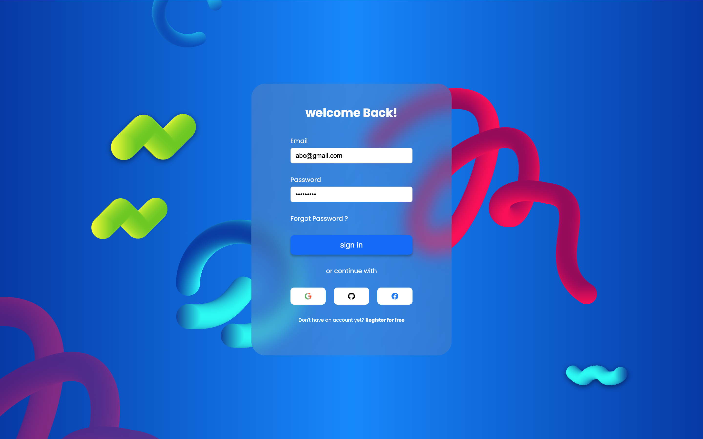

# ✨ Login Page UI/UX Design (Figma to Code)

A modern and responsive **login page UI** built using **HTML**, **CSS**, and **JavaScript**, inspired by a **Figma design**. This project demonstrates how to convert a high-fidelity design into clean, interactive code while preserving aesthetic and functional details.

 <!-- Make sure to update this image name if your screenshot differs -->

---

## 🚀 Features

- 🎨 Stylish glassmorphism login card with background blur
- 🖼️ Multiple background SVGs for a layered visual experience
- 👤 Login form with email and password inputs
- 🔒 Basic form validation (alerts on empty fields)
- 🔗 Social login options (Google, GitHub, Facebook) with icons
- 📱 Fully responsive layout

---

## 🛠️ Built With

- **HTML5** – Semantic structure
- **CSS3 (Module)** – Layout, animations, glass effect
- **JavaScript (Vanilla)** – Basic form logic
- **[Remix Icon](https://remixicon.com/)** – Social media icons
- **[Google Fonts - Poppins](https://fonts.google.com/specimen/Poppins)** – Font styling

---
